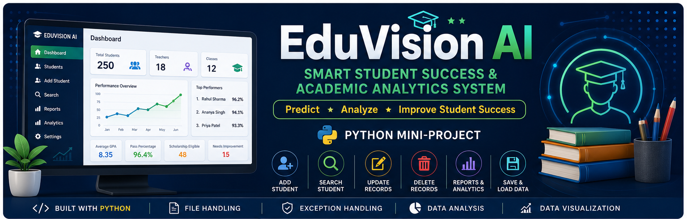

## 👨‍🎓 Author
Name: Anikeit Bagaria  
Roll Number: 590040405  
Course: M. Tech. CSE  
Institution: UPES  

## 🎓 EduVision: Smart Student Performance Analytics & Academic Management System - Student Management System

A Student Management System developed in Python as a mini-project to demonstrate the application of fundamental Python programming concepts. The project provides a simple menu-driven interface for managing student records, allowing users to add, view, search, update, and delete student information efficiently.

# 🎓 EduVision AI

## Smart Student Success & Academic Analytics System


## 📑 Table of Contents

- [Project Objectives](#project-objectives)
- [Features](#features)
- [Technologies Used](#technology-used)
- [Repository Structure](#repository-structure)
- [Getting Started](#getting-started)
- [Sample Output](#sample-output)
- [Learning Outcomes](#learning-outcomes)
- [Future Enhancements](#future-enhancements)
- [License](#license)

## 📌 Project Objectives

* Develop a menu-driven Student Management System.
* Apply core Python programming concepts in a real-world application.
* Organize and manage student records efficiently.
* Demonstrate good coding practices with meaningful variable and function names.
* Provide a modular and easy-to-understand implementation.

## ✨ Features

* ➕ Add a new student record
* 📋 Display all student records
* 🔍 Search for a student by ID
* ✏️ Update student details
* ❌ Delete a student record
* 💾 Save and load records using a CSV file
* ⚠️ Input validation and exception handling

## 🛠️ Technologies Used

* Python 3.x
* Jupyter Notebook
* CSV File Handling
* Standard Python Libraries

[⬆ Back to Top](#table-of-contents)

## 📂 Repository Structure

```text
Student-Management-System/
│
├── README.md
├── requirements.txt
│
├── notebooks/
│   └── Student_Management_System.ipynb
│   └── main.py
│   └── student.py
│   └── file_manager.py
│   └── analytics.py
│
├── datasets/
│   └── students.csv
│
├── images/
│   ├── system_flowchart.png
│
└── LICENSE
```

## 🚀 Getting Started

### Prerequisites

* Python 3.8 or later
* Jupyter Notebook or JupyterLab

### Installation

1. Clone the repository:

```bash
git clone https://github.com/anikeitbagaria/Student-Management-System.git
```

2. Navigate to the project directory:

```bash
cd Student-Management-System
```

3. Install dependencies (if required):

```bash
pip install -r requirements.txt
```

4. Launch Jupyter Notebook:

```bash
jupyter notebook
```

5. Open the `Student_Management_System.ipynb` notebook from the `notebooks/` folder and run the cells.

## 📖 Python Concepts Demonstrated

This project incorporates the following Python concepts:

* Variables and Data Types
* Input and Output
* Conditional Statements
* Loops
* Functions
* Lists
* Dictionaries
* File Handling
* Exception Handling
* Modular Programming

## 📷 Sample Output

The application provides a menu-driven interface similar to the following:

===== Student Management System =====

1. Add Student
2. Display Students
3. Search Student
4. Update Student
5. Delete Student
6. Save Records
7. Student Statistics
8. Grade Distribution Chart
9. Exit
=============================================
Enter your choice:


## 📚 Learning Outcomes
By completing this project, students will learn how to:
* Build a menu-driven Python application.
* Organize data using lists and dictionaries.
* Implement CRUD (Create, Read, Update, Delete) operations.
* Use functions to improve code modularity.
* Handle invalid user input using exception handling.
* Store and retrieve data using files.

## 🔮 Future Enhancements
* Graphical User Interface (GUI) using Tkinter.
* Database integration using SQLite or MySQL.
* Student attendance management.
* Report card generation.
* Authentication for administrators.
* Data visualization using Matplotlib or Seaborn.

## 📄 License
This project is intended for educational purposes. You are free to use, modify, and enhance it for learning and academic submissions.

To make Student Management System stand out from typical Python lab projects, several practical features can be added. Here are some ideas.

## 📄 Use of AI Tools

* AI Tool ChatGPT was used extensively and effectively during the preparation of this project. 
* ChatGPT was used to conceptualise the project and also during codification. 
* Further ChatGPT was used to generate ideas for project improvement


⭐ High-Impact Features

1. Student Dashboard: Display key statistics in one place.
====================================
 STUDENT DASHBOARD
====================================
Total Students      : 35
Highest Average     : 96.3
Class Average       : 81.4
Average GPA         : 8.2
Pass Percentage     : 94%
Topper              : Rahul Sharma
====================================
Concepts Used: Pandas, Functions, Data Analysis

2. Rank List: Automatically rank students.
Rank  Name            Average
1     Rahul Sharma      95.4
2     Priya Patel       93.2
3     Amit Kumar        91.8
Uses: Sorting. Lists, Functions

3. Department-wise Analysis
Computer Science
Students : 18
Average : 83.6
Highest : 98
Lowest : 61
Also display a departmental bar chart.

4. Search by Multiple Criteria: Instead of only Roll Number
Search by: Name, Department, Grade, GPA

Search Student
1 Roll Number
2 Name
3 Department
4 Grade
5 GPA

5. Student Report Card
================================
STUDENT REPORT CARD
================================
Name
Roll Number
Department
Subject Marks
Average
Grade
GPA
Attendance
Rank
================================

⭐ Data Visualization Features

6. Subject-wise Comparison: Bar Chart
Python █████████████
Data Science ███████████
Statistics ████████████████
7. Attendance Pie Chart: Present 85%, Absent 15%
8. Pass vs Fail Chart: Pie chart: Pass: 92%, Fail: 8%
9. Top 10 Students Graph: Horizontal bar chart
Rahul █████████████
Priya ██████████
Rohit █████████
10. GPA Distribution Histogram: Shows overall academic performance.

⭐ Student Management Features

11. Attendance Management
12. Scholarship Eligibility
Automatically determine: Average >85, Attendance >80%
Scholarship Eligible
13. Course Registration
14. Multiple Semesters: Semester 1, 2, 3, Calculate cumulative GPA.
15. Teacher Remarks: Excellent, Needs Improvement, Very Good

⭐ File Handling Features

16. Automatic Backup: Every save creates students.csv, students_backup.csv
17. Export Report: Generate
student_report.csv, department_report.csv, topper_report.csv
18. Import Existing CSV: Allow users to import students.csv from another source.

⭐ User Experience Features

19. Colored Console Output: Use colorama
Green: Student Added Successfully
Red: Student Not Found
Yellow: Warning
20. Confirmation Before Delete: Delete Student? Y/N
21. Password Protection: Admin Login: Username, Password

⭐ Advanced Python Features

22. Email Validation
abc@gmail.com
Reject invalid email addresses.
23. Phone Number Validation: Must be exactly 10 digits.
24. Roll Number Generator: Automatically assign
25. Duplicate Detection: Prevent duplicate
Roll Number, Email, Mobile Number
26. Undo Delete: Recover the last deleted student.

⭐ Analytics Features

27. Student Performance Prediction: Predict, Excellent. Average, Needs Improvement based on GPA and attendance.
28. Performance Trend: Show whether a student's marks are
Improving, Declining, Stable
29. Grade Distribution Table: A+ 10, A 15, B 18, C 7, Fail 2
30. Average Subject Score: Python 82, Data S 79, Statistics 85

⭐ Bonus Features

31. Menu Icons
1 ➕ Add
2 🔍 Search
3 📊 Statistics
4 📈 Charts
5 ❌ Exit

32. PDF Report Card: Generate a printable report card using ReportLab.
33. Excel Export: Export all records to .xlsx using openpyxl.
34. Student ID Card: Generate a simple ID card with:
Student name, Roll number, Department, GPA
